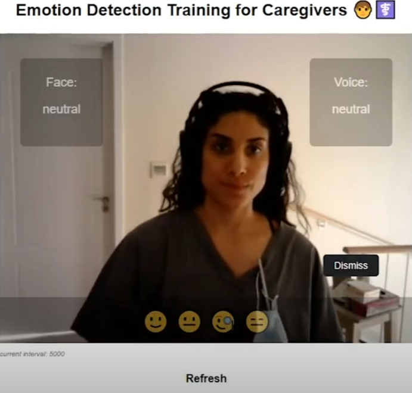
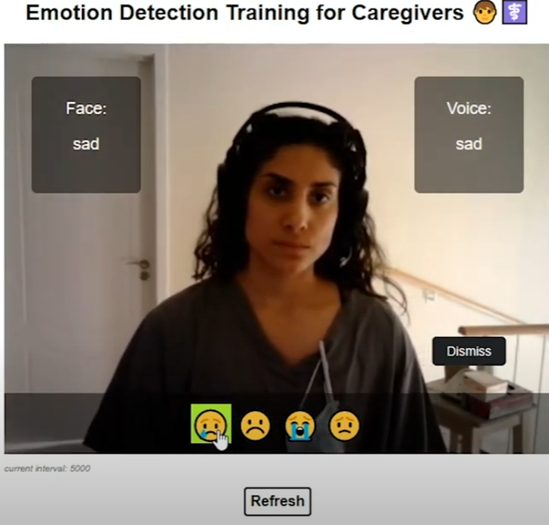
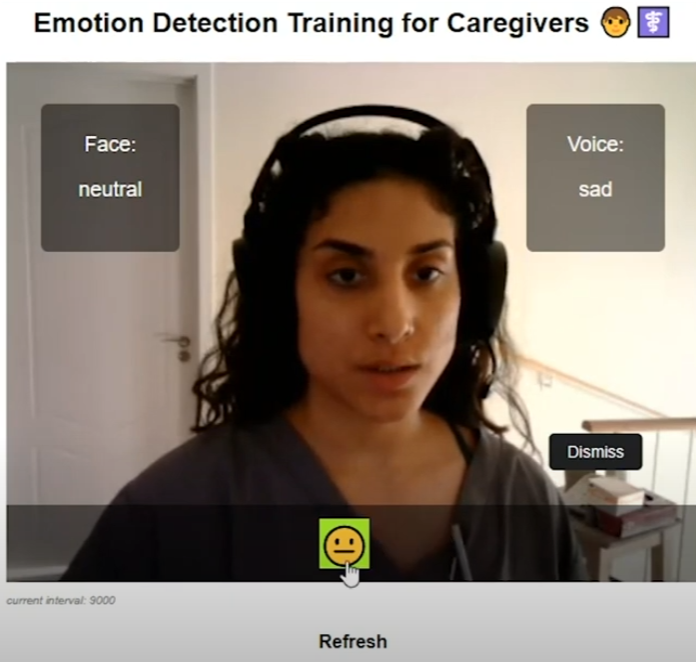
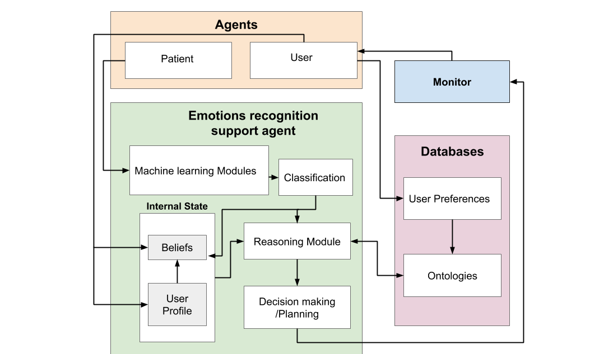

# 👩🏼‍⚕️ CERT 👨🏼‍⚕️
## Caregivers Emotional Recognition Training

The ability to recognise patients’ emotions and respond appropriately is a critical skill for caregivers to have and regularly refine. Acquiring this ability is not easy - it can be especially challenging considering patients undergoing treatment may express emotion in highly variable ways.

CERT is an AI-based system developed as a potential method for helping inexperienced caregivers (who are under high cognitive load) recognise and reflectively consider the emotions expressed by patients. 

## Use-Case Scenario 

The system is to be used in training. Two individuals have a conversation in a healthcare facility; one fulfills the role of the caregiver (the trainee) and the other fulfills the role of the patient (this supporting individual may be the examiner, a colleague, or volunteer for training purposes). 

### Equipment

A camera and microphone directed at the “patient” as the consultation is captured through video and audio data as input. The system’s feedback is delivered through a monitor presented only to the caregiver equipped with an user-input device (e.g. a mouse) for interactive purposes. 

The consultation proceeds as it would in practice, with the trainee caregiver asking prompting questions to the patient and/or delivering important information about their current treatment and care. As the patient responds, the system picks up on distinctive emotional cues through facial expression and inflection in the voice. 

### System Behaviour and Interface

The system shows an array of emojis that correspond to detected emotions (anger, sadness, happiness, neutral) delivered by Machine Learning models trained on image data and voice data respectively. For example, if the system detects sadness, the caregiver is informed of this classification through the use of virtual graphics, indicating by which modality the emotion was detected (face or voice). The caregiver can then choose one emoji they resonate with the most, as a reflective exercise. 


Neutral Emotion Instantiation                               |  Sad Emotion Detection                              | Emoji Single Selection
:----------------------------------------------------------:|:---------------------------------------------------:|:-------------------------------------------------------:
 |  | 

If the user disagrees with the system’s prompt, the emoji overlay can be dismissed. The emojis shown are ordered by frequency of use / selection from previous interactions. The rate at which the system prompts the user with emojis is also a function of previous interactions; low interaction prolongs time interval between system updates, while high interaction reduces time interval between system updates.

### Architecture

This image demonstrates how each module of the system is integrated.




# Demo Requirements 💻

Make sure to have python v3.7 and pip installed in order to run

```pip install -r requirements.txt```

On a Windows machine, ```pip install pyaudio``` will fail. Instead, ```pip install pipwin``` and then ```pipwin install pyaudio``` to download the package.

change directories ```cd webapp``` and launch the service via commandline ```python emotion-webstream.py```

Visit http://localhost:8000/ on preferred browser to view and interact with demo

## Disclaimer ⚠️

This is an experimental version of the system and runs on alpha versions of external libraries and will not be maintained. It is not recommended to be used for any purpose outside of testing and exploration. This repo is for demonstration purposes only.

Make sure to give webcam permissions - no video data is captured during program execution
Make sure to give mic permisions - audio data _is_ saved locally in the the "sound" directory titled "soundfile.wav" but is not stored in any external database - the file will be locally stored and can be manually removed.
